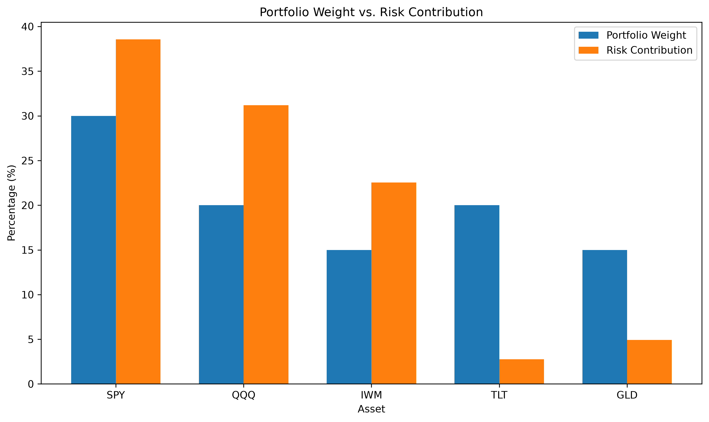
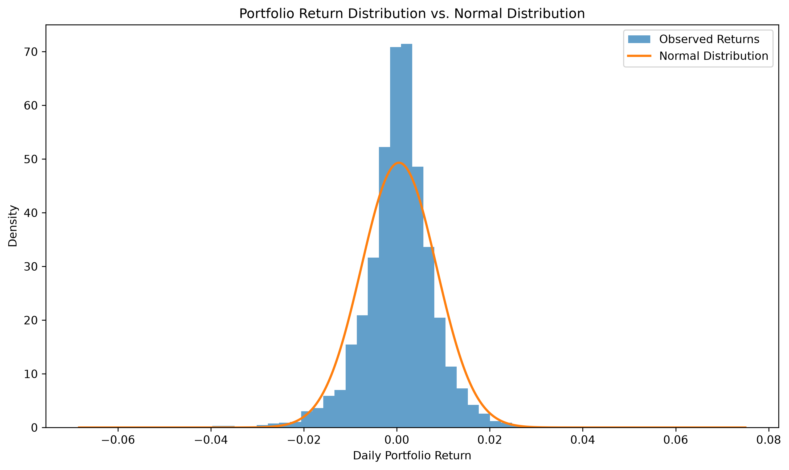
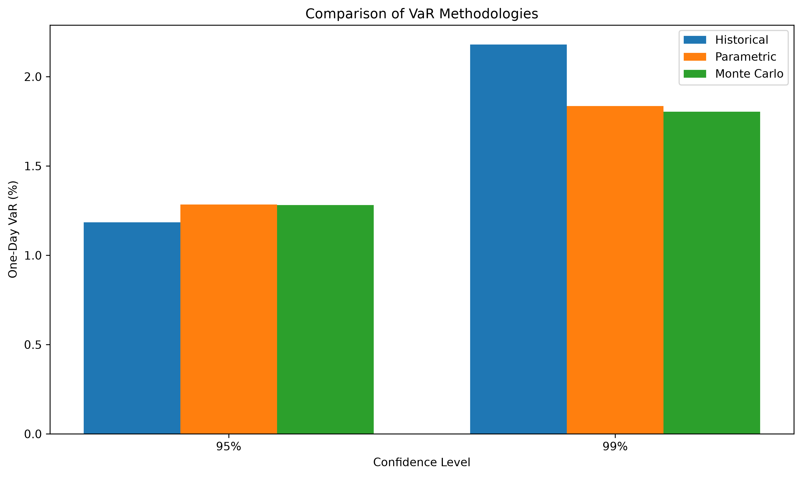

# Project 01 — Market Risk Engine

A Python-based market risk engine for measuring and comparing portfolio risk using Historical VaR, Parametric VaR, Monte Carlo VaR, and Expected Shortfall.

The project implements a modular quantitative risk framework and applies it to a diversified ETF portfolio containing equities, bonds, and gold. The analysis covers approximately 11 years of daily market data from 2015 through 2025.

---

## Project Overview

This project was developed as a practical implementation of core market-risk methodologies used in quantitative risk management.

The engine calculates:

- Portfolio volatility
- Marginal and component risk contributions
- Historical Value at Risk (VaR)
- Parametric VaR
- Monte Carlo VaR
- Historical Expected Shortfall (ES)
- Monte Carlo Expected Shortfall
- Cross-methodology VaR comparisons

The project also examines the distributional characteristics of asset returns and evaluates how assumptions about return distributions affect estimated tail risk.

## Portfolio

| Asset | Weight | Description |
|---|---:|---|
| SPY | 30% | U.S. large-cap equities |
| QQQ | 20% | U.S. technology/growth equities |
| IWM | 15% | U.S. small-cap equities |
| TLT | 20% | Long-duration U.S. Treasuries |
| GLD | 15% | Gold |

The portfolio intentionally combines assets with different risk characteristics to examine diversification, correlation, and tail-risk behavior.

## Methodologies

### Historical VaR
Estimates VaR directly from the empirical distribution of historical portfolio returns.

### Parametric VaR
Estimates VaR assuming normally distributed portfolio returns using the portfolio mean and volatility.

### Monte Carlo VaR
Generates simulated asset-return scenarios using the historical mean and covariance matrix and estimates VaR from the simulated portfolio-return distribution.

### Expected Shortfall
Measures the average loss beyond the VaR threshold and provides a more informative measure of tail risk.

## Key Results

### Portfolio Risk

| Metric | Result |
|---|---:|
| Annualized Portfolio Volatility | 12.84% |
| Historical VaR — 95% | 1.18% |
| Parametric VaR — 95% | 1.28% |
| Monte Carlo VaR — 95% | 1.28% |
| Historical VaR — 99% | 2.18% |
| Parametric VaR — 99% | 1.84% |
| Monte Carlo VaR — 99% | 1.80% |
| Historical ES — 95% | 1.91% |
| Historical ES — 99% | 3.25% |

### Risk Contribution

The risk contribution analysis demonstrates that portfolio allocation and contribution to total portfolio risk are not equivalent. Equity exposures contribute disproportionately to portfolio risk relative to their portfolio weights.

### Portfolio Return Distribution

The observed portfolio return distribution is compared with a fitted normal distribution. The deviation from normality is relevant when evaluating the suitability of normal-distribution assumptions for parametric risk measures.

### VaR Methodology Comparison

At the 95% confidence level, the three VaR methodologies produce relatively similar estimates. At the 99% confidence level, Historical VaR is materially higher than both Parametric and Monte Carlo VaR, indicating greater sensitivity to observed tail behavior.

## Limitations

- Parametric VaR relies on a normality assumption that may underestimate extreme tail events.
- Historical VaR is dependent on the historical sample and may not represent future market regimes.
- Monte Carlo results depend on the assumed return distribution and covariance structure.
- The model does not currently incorporate volatility clustering, regime changes, transaction costs, or liquidity effects.
- Backtesting and formal VaR validation are outside the scope of this project.